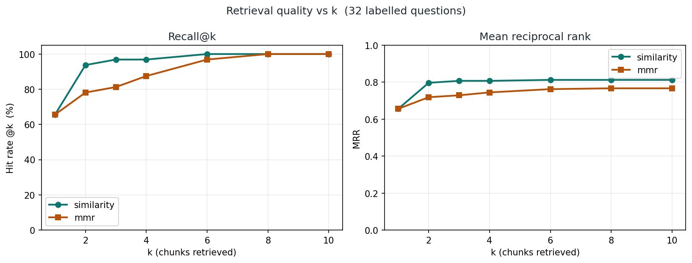
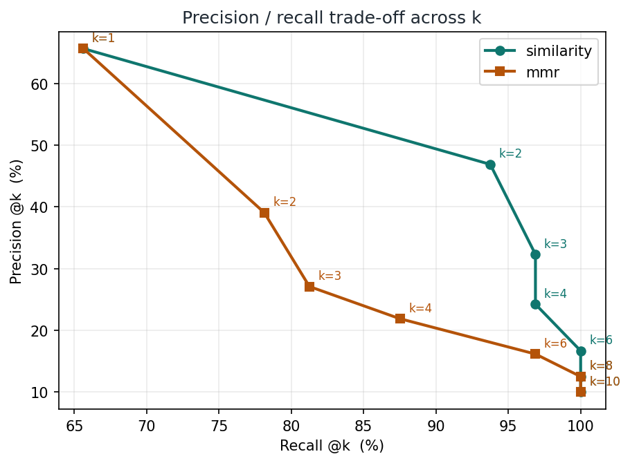

# Medical AI RAG System

[](https://github.com/Saheed7/medical-ai-rag-system/actions/workflows/ci.yml)
[](https://www.python.org/)
[](LICENSE)
[](https://huggingface.co/spaces/Kayodenet/medical-ai-rag-system)

**[▶ Live demo](https://huggingface.co/spaces/Kayodenet/medical-ai-rag-system)** ·
**[🎥 Video walkthrough](https://youtu.be/YOUR_VIDEO_ID)** ·
**[⚙ CI runs](https://github.com/Saheed7/medical-ai-rag-system/actions)**

A production-oriented **Retrieval-Augmented Generation** service that answers
medical questions strictly from an indexed reference corpus, returning
**page-level citations** with every answer — and explicitly refusing when the
corpus has no answer.

Built end to end: ingestion pipeline, vector retrieval, grounded generation,
containerisation, automated security scanning, CI/CD, artifact management, and
cloud deployment.


---

## Table of contents

- [Why this exists](#why-this-exists)
- [Results at a glance](#results-at-a-glance)
- [Architecture](#architecture)
- [Design decisions](#design-decisions)
- [Tech stack](#tech-stack)
- [Quickstart](#quickstart)
- [Configuration](#configuration)
- [Testing](#testing)
- [Evaluation](#evaluation)
- [CI/CD pipeline](#cicd-pipeline)
- [Security](#security)
- [Deployment architecture](#deployment-architecture)
- [Engineering log: problems and resolutions](#engineering-log-problems-and-resolutions)
- [Limitations and roadmap](#limitations-and-roadmap)
- [Cost](#cost)
- [Disclaimer](#disclaimer)

---

## Why this exists

General-purpose language models produce fluent, confident, and occasionally
fabricated medical claims. In a domain where a wrong dosage or an invented
contraindication carries real risk, fluency without provenance is a liability.

This system constrains generation to a curated corpus and makes every claim
auditable. The answer arrives with the exact passages and page numbers it was
derived from, so a reader can verify rather than trust. When retrieval returns
nothing relevant, the system says so instead of interpolating.

The engineering question underneath is the one that matters in production:
**how do you make a probabilistic component behave predictably enough to
deploy?**

---

## Results at a glance

| Metric | Value | Note |
|---|---:|---|
| Source corpus | 759 pages | *Gale Encyclopedia of Medicine*, 2nd ed. |
| Pages successfully extracted | 758 | 1 blank page correctly discarded |
| Indexed vectors | 4,932 | 800-char chunks, 120-char overlap |
| Embedding dimensions | 384 | `all-MiniLM-L6-v2`, normalised |
| Retrieval | similarity, k=4 | chosen by measurement, not assumption |
| **Hit rate@4** | **96.9%** | 32 labelled questions, strict page match |
| **MRR@4** | **0.807** | mean reciprocal rank of the correct page |
| **Refusal rate** | **90%** | 10 out-of-corpus probes correctly declined |
| Container image | **695 MB** | vs ~6 GB with default CUDA torch (**8.6× smaller**) |
| Engine cold start | **4.9 s** | index + embedding model, both baked in |
| Test suite | 21 tests | hermetic: no network, no index, no API key |
| CI duration | ~2m 35s | lint + tests on Python 3.10 and 3.12, + secret scan |
| Full CD pipeline | ~8m 34s | checkout → test → fetch → build → scan → push |
| HIGH/CRITICAL CVEs | **0** | 7 found and remediated at source |

---

## Architecture

```
┌──────────────────── INGESTION (offline, one-shot) ─────────────────────┐
│                                                                        │
│  data/*.pdf → PyPDFLoader → text cleaning → recursive chunking          │
│                              (de-hyphenate,   (800 chars,               │
│                               strip headers)   120 overlap)             │
│                                     ↓                                   │
│                          MiniLM embeddings (384-dim, normalised)        │
│                                     ↓                                   │
│                          FAISS index → tar.gz → private S3              │
│                                     ↓                                   │
│                    INDEX_MANIFEST.json (version, sha256, config)        │
└────────────────────────────────────────────────────────────────────────┘

┌──────────────────── SERVING (online, per request) ─────────────────────┐
│                                                                        │
│  question → MMR retrieval (k=4) → prompt assembly → Llama-3.1-8B        │
│                from FAISS          (system rules +     via HF           │
│                                     numbered excerpts)  Inference       │
│                                     ↓                                   │
│                        grounded answer + page citations                 │
│                        (or explicit "not in corpus")                    │
└────────────────────────────────────────────────────────────────────────┘

  Gradio UI  ⇄  FastAPI  →  /health reports per-component readiness
```

### The artifact boundary

The FAISS index is treated as a **versioned build artifact**, not source code:

```
Developer machine          Private S3                CI / Runtime
─────────────────          ──────────                ────────────
build_index.py    ──────►  faiss_index.tar.gz  ────► fetch_index.py
publish_index.py           (8.1 MB)                  verify SHA-256
     │                                               extract or ABORT
     ▼
INDEX_MANIFEST.json ──── committed to Git ──────────────► pins the exact object
```

The manifest records not just the checksum but **the configuration that
produced the index** — embedding model, chunk size, overlap, vector count. If
someone changes `CHUNK_SIZE` without rebuilding, the mismatch is visible rather
than silently degrading retrieval quality.

---

## Design decisions

| Decision | Rationale |
|---|---|
| **Singleton engine, warmed at startup** | The embedding model (~90 MB) and FAISS index load once per process. A naive implementation reloads per request — seconds of latency and constant memory churn on every message. |
| **Independent component caching** | A failure in one stage (missing API token) must not discard a successful index load. Verified: 3 failing requests trigger **1** index load, not 3. |
| **Similarity over MMR** *(reversed by measurement)* | I hypothesised MMR would help, since entries span consecutive pages and top-k similarity returns near-duplicates. Measured on 32 labelled questions, plain similarity won at every k > 1 — **96.9% vs 87.5%** hit rate at k=4. The default was changed to match the evidence. |
| **800-char chunks / 120 overlap** | Large enough to hold a complete symptom list or definition; overlap prevents facts being severed at a boundary. |
| **Normalised embeddings** | Lets FAISS inner-product search act as cosine similarity with no separate normalisation pass. |
| **Explicit no-answer sentinel** | The prompt defines an exact refusal string. The engine detects it and suppresses citations, so the UI never shows sources for a non-answer. |
| **Typed exception hierarchy** | A missing index and an upstream timeout are different failures with different fixes. The UI maps each to actionable guidance instead of a stack trace. |
| **Component-level health endpoint** | `/health` returns `retriever_ready` and `llm_ready` separately. A binary up/down check cannot distinguish "retrieval broken" from "generation broken" — the distinction that matters at 3am. |
| **CPU-only torch** | `sentence-transformers` pulls `torch`, and PyPI's default wheel carries ~3 GB of CUDA libraries useless on CPU inference. Installing the CPU build first is the single largest factor in image size. |
| **Embedding model baked into image** | Otherwise every cold start downloads ~90 MB from an external host. A service that cannot start when a third party is down is not production-ready. |
| **Security floors, major-version ceilings** | `>=` pins let patches in; `<7.0.0` on Gradio prevents a major release silently breaking the UI. Exact pins guarantee the image rots. |
| **Provider pinned explicitly** | Hugging Face routes through third-party inference providers. `auto` is not reproducible across environments; `LLM_PROVIDER=novita` is. |

---

## Tech stack

| Layer | Technology |
|---|---|
| Orchestration | LangChain 1.x (LCEL) |
| Embeddings | `sentence-transformers/all-MiniLM-L6-v2` |
| Vector store | FAISS (CPU) |
| LLM | `meta-llama/Llama-3.1-8B-Instruct` via HF Inference Providers |
| UI | Gradio 6 |
| Web server | FastAPI + Uvicorn |
| Config | pydantic-settings (validated at import) |
| Testing | pytest |
| Container | Docker (multi-stage, non-root, CPU-only torch) |
| CI | GitHub Actions (ruff, pytest ×2 Python versions, gitleaks) |
| CD | Jenkins (Docker-outside-of-Docker) |
| Security scanning | Aqua Trivy |
| Artifact storage | AWS S3 (SHA-256 verified) |
| Registry | AWS ECR (private) |
| Public demo | Hugging Face Spaces |

---

## Quickstart

**Prerequisites:** Python 3.10+, Docker (optional), a free
[Hugging Face token](https://huggingface.co/settings/tokens).

```bash
git clone https://github.com/Saheed7/medical-ai-rag-system.git
cd medical-ai-rag-system

python -m venv .venv
source .venv/bin/activate            # Windows: .venv\Scripts\activate
pip install -r requirements-dev.txt

cp .env.example .env                 # then set HF_TOKEN
```

Place your own copy of the corpus PDF in `data/`, then:

```bash
python scripts/diagnose_pdf.py       # verify the PDF before a 20-min build
python -m app.ingestion.build_index  # one-off, ~10-25 min on CPU
python -m app.main
```

Open <http://localhost:8080>. Health probe at `/health`.

### Container

```bash
docker build --provenance=false --sbom=false -t medical-ai-rag-system:latest .
bash scripts/verify_docker.sh        # 16 staged checks
```


### Diagnostics

Four scripts cover the failure modes worth having tooling for:

| Symptom | Run |
|---|---|
| `no extractable text was found` | `python scripts/diagnose_pdf.py` |
| `HF_TOKEN is not set` | `python scripts/check_env.py` |
| `404 ... router.huggingface.co` | `python scripts/check_llm.py` |
| Before any push | `python scripts/preflight_git.py` |

---

## Configuration

Every setting is overridable via `.env` or environment variables, and validated
at import time — misconfiguration fails at boot, not mid-request.

| Variable | Default | Purpose |
|---|---|---|
| `HF_TOKEN` | *(required)* | Hugging Face Inference token |
| `LLM_REPO_ID` | `meta-llama/Llama-3.1-8B-Instruct` | Generation model |
| `LLM_PROVIDER` | `auto` | Inference provider (pin explicitly) |
| `EMBEDDING_MODEL_ID` | `all-MiniLM-L6-v2` | Embedding model |
| `CHUNK_SIZE` / `CHUNK_OVERLAP` | `800` / `120` | Ingestion chunking |
| `RETRIEVAL_TOP_K` | `4` | Chunks passed to the LLM |
| `RETRIEVAL_STRATEGY` | `mmr` | `mmr` or `similarity` |
| `ENVIRONMENT` | `development` | `development` / `production` |
| `PORT` | `8080` | HTTP listen port |

Validators enforce `chunk_overlap < chunk_size` and
`retrieval_strategy ∈ {mmr, similarity}`.

---

## Testing

```bash
pytest -v --cov=app --cov-report=term-missing
```

21 tests covering configuration validation, PDF text-cleaning heuristics,
chunking invariants (sequential IDs, metadata preservation), prompt contracts,
context formatting, and citation rendering.

The suite is **deliberately hermetic** — no network calls, no API key, no
prebuilt index required. That keeps CI fast (~2m 35s including two Python
versions) and means a failure indicates a real defect rather than a flaky
dependency.

Coverage is intentionally not 100%. The uncovered paths are the ones requiring
a live model endpoint or a built index; claiming full coverage on a system with
external dependencies would be misleading.

---

## Evaluation

Retrieval configuration is measured, not asserted. `eval/questions.json` holds
**32 questions spanning pages 16–746**, each labelled with the page containing
its answer. Labels are machine-verified — the anchor term for each question
provably appears in the extracted text of its labelled page — and can be
re-audited after any ingestion change.

```bash
python scripts/evaluate_retrieval.py --audit      # re-verify the labels
python scripts/evaluate_retrieval.py              # sweep strategy x k
python scripts/evaluate_retrieval.py --failures   # inspect what missed
python scripts/evaluate_refusal.py                # guardrail validation
python scripts/evaluate_answerability.py --plot   # confusion matrix
python scripts/plot_eval.py                       # figures (needs matplotlib)
```

Retrieval evaluation makes **no LLM calls** — free, and runs in seconds.

| Metric | What it captures |
|---|---|
| **Hit rate@k** | Fraction of questions with a relevant page in the top k. One relevant page per question, so this is recall@k. |
| **MRR** | Mean reciprocal rank of the first relevant page — rewards ranking it *first*, not merely retrieving it. |
| **Refusal rate** | Share of 10 out-of-corpus probes correctly declined instead of answered. |

### Results

32 questions, strict page matching (`--tolerance 0`), full sweep in ~11 s:

| Configuration | Hit rate | MRR | Mean rank | Misses |
|---|---:|---:|---:|---:|
| `mmr`, k=1, λ=0.5 | 65.6% | 0.656 | 1.00 | 11 |
| `mmr`, k=2, λ=0.5 | 78.1% | 0.719 | 1.16 | 7 |
| `mmr`, k=4, λ=0.5 | 87.5% | 0.745 | 1.43 | 4 |
| `mmr`, k=8, λ=0.5 | 100.0% | 0.767 | 1.97 | 0 |
| `similarity`, k=1 | 65.6% | 0.656 | 1.00 | 11 |
| `similarity`, k=2 | 93.8% | 0.797 | 1.30 | 2 |
| **`similarity`, k=4** | **96.9%** | **0.807** | 1.35 | 1 |
| `similarity`, k=8 | 100.0% | 0.813 | 1.50 | 0 |

**What this changed.** The original default was `mmr`, chosen from reasoning
about corpus structure. Similarity beat it at every k > 1, so
**the default was changed to `similarity`**. Documenting the reasoning is worth
little if the reasoning is not then tested against the data.



Similarity dominates across the range. Both converge at k=8, but retrieving 8
chunks doubles prompt size for the same answer — so the useful comparison is at
k=4, where similarity is 9.4 points ahead.



The precision–recall view makes the trade-off explicit: with one relevant page
per question, precision@k is capped at 1/k, so raising k buys recall at a
predictable cost. The similarity curve sits strictly above MMR — better recall
at every precision level, which is the definition of a dominating configuration.

**Scope caveat.** These 32 questions are definitional — each answer lives on one
page. That is precisely the case where diversity hurts and similarity wins. MMR
would plausibly do better on multi-hop questions spanning several entries, which
this set does not contain. The honest claim is *"similarity is better for this
query type on this corpus"*, not *"MMR is worse."*

**Every failure is an off-by-one page.** Inspecting the four MMR misses:

| Question | Expected | Retrieved |
|---|---|---|
| What is cardiac catheterization used to diagnose? | 44 | 287, 551, **46, 45** |
| What is a cataract? | 62 | **63**, 60, **63**, 646 |
| Which organs does cystic fibrosis affect? | 373 | **374**, 86, 379, 514 |
| What causes echinococcosis? | 514 | **515**, 622, 353, **512** |

All four retrieved an adjacent page. Entries straddle page boundaries, so the
chunk containing the answer legitimately carries the neighbouring page number.
At `--tolerance 1`, MMR k=4 reaches **100%**. Both figures are reported because
quoting only the charitable one would overstate the result.

### Refusal guardrail

**9 / 10 out-of-corpus probes correctly declined (90%).** Median latency ~680 ms.

The single failure is instructive. Asked *"What is the boiling point of liquid
nitrogen?"*, the system responded:

> *I could not find the boiling point of liquid nitrogen in the reference
> material. However, Excerpt 1 mentions that liquid nitrogen has a temperature
> of…*

The corpus **does** discuss liquid nitrogen — in cryotherapy entries — so
retrieval surfaced genuinely related context. The model refused the actual
question, then volunteered adjacent detail. The sentinel check treats that as a
failure because the exact refusal string was not emitted alone.

This is the hardest case for a citation-bound system: not fabrication, but a
correct refusal followed by unrequested elaboration. Two fixes worth testing —
strengthen the prompt to prohibit continuing past a refusal, or detect the
sentinel as a prefix and truncate. Both are measurable against this same probe
set, which is the point of having one.

### Answerability as classification

Combining both sets gives a genuine binary task with ground truth — 32
questions the system *should* answer, 10 it *should* refuse:

```bash
python scripts/evaluate_answerability.py --plot
```


The two error types are not symmetric, and that asymmetry is the whole point:

| Error | Meaning | Severity |
|---|---|---|
| **False answer** | Answered an unanswerable question | Serious — this is the hallucination path |
| **False refusal** | Refused an answerable question | Mild — unhelpful, not unsafe |

For a citation-bound medical system, a model tuned toward over-refusal is
strictly preferable to one tuned toward over-answering. Reporting accuracy alone
would obscure that; the confusion matrix keeps it visible.

### Plots deliberately not included

| Plot | Why not |
|---|---|
| **Training / validation curves** | Nothing is trained. The embedding model is pretrained and frozen; there is no loss, no epochs, no fitting. A learning curve would be fabricated. |
| **ROC curve** | The refusal decision is sentinel detection, not a tunable score threshold. Sweeping an invented threshold to produce an AUC would misrepresent how the system works. |

Both are standard in supervised learning and neither applies to a frozen-encoder
retrieval system. Including them would look thorough and be wrong.

**On reporting honestly.** Encyclopedia entries span page boundaries and chunks
straddle them, so a chunk answering the question can carry an adjacent page
number. `--tolerance 1` counts that as a hit. Both figures are reported: strict
(0) and charitable (1). Quoting only the charitable number without saying so
would be misleading.

Sweeping `k` and `mmr` vs `similarity` requires no reindexing, because
retrieval parameters are read from configuration rather than hardcoded — a
payoff from the design decisions above.

---

## CI/CD pipeline

**GitHub Actions** runs on every push: `ruff` lint, `pytest` on Python 3.10 and
3.12, and a `gitleaks` scan of the full history.

**Jenkins** runs the deployment pipeline from a custom controller image
containing the Docker CLI, AWS CLI v2, and Trivy.


| Stage | Time | What it does |
|---|---:|---|
| Checkout | <1 s | Clones the commit |
| Quality gate | 27 s | ruff + pytest, publishes JUnit results |
| Fetch index artifact | 3 s | Downloads from S3, **verifies SHA-256** |
| Build image | 4m 25s | Multi-stage build on the host daemon |
| Security scan | 1m 21s | Trivy HIGH/CRITICAL, archives JSON report |
| Push to ECR | 2m 12s | Tags `:<sha>` and `:latest` |
| Deployment summary | <1 s | Reports the published image |


### Docker-outside-of-Docker

Jenkins runs in a container but must build containers. Two standard options:

| | Docker-in-Docker | **Docker-outside-of-Docker** (chosen) |
|---|---|---|
| Mechanism | Nested daemon | Mount host `/var/run/docker.sock` |
| `--privileged` | Required | Not required |
| Layer cache | Cold every build | Shares the host cache |
| Storage driver | Nested-overlay issues | None |

**The honest caveat:** socket access is host-root-equivalent regardless of
which user holds it. Neither approach suits untrusted multi-tenant builds —
those want a rootless builder such as Kaniko or BuildKit. For a single-tenant
controller, DooD gives the same capability without `--privileged`.

---

## Security

| Control | Implementation |
|---|---|
| Secret scanning (history) | gitleaks in GitHub Actions |
| Secret scanning (pre-push) | `scripts/preflight_git.py` — HF, AWS, GitHub, OpenAI key patterns, private keys, hardcoded passwords |
| Image vulnerability scanning | Trivy, fails the build on HIGH/CRITICAL with an available fix |
| Non-root container | UID 1001, no shell access needed |
| Least privilege | Three separate IAM users: dev (S3 write), CI (**S3 read-only**), demo (S3 read-only) |
| Credential storage | Jenkins credential store / Space secrets — never in Git, never in an image layer |
| Supply chain | Trivy installed from the GPG-signed APT repository, not `curl \| sh` |


### The IAM asymmetry is deliberate

The developer identity can **write** index artifacts to S3. CI and the demo can
only **read** them. A compromised pipeline cannot overwrite the index that
production serves.

### Remediation record

Trivy's first run failed the build with 7 HIGH findings. All were fixed at
source; none were suppressed.

| Package | Issue | Resolution |
|---|---|---|
| `langchain` | CVE-2026-44843, insecure deserialization | **Removed** — nothing imported it |
| `pypdf` | CVE-2026-59935/59936, DoS via crafted PDF | Floor raised to 6.16.2 |
| `starlette` | CVE-2025-62727, CVE-2026-48818 (SSRF, NTLM theft) | Floor to 1.6.0; required a newer `fastapi` |
| `pillow` | CVE-2026-25990/59205, OOB write | Floor to 12.3.0 |
| `langsmith` | GHSA-f4xh-w4cj-qxq8, arbitrary file read | Floor to 0.12.1 |
| `msgpack` | GHSA-6v7p-g79w-8964, OOB read | Floor to 1.2.2 |
| `setuptools` + vendored `wheel` | CVE-2025-47273, CVE-2026-24049 | Upgraded in **both** Python environments |

The best fix for a vulnerable dependency is often not needing it.

---

## Deployment architecture

The Jenkins pipeline publishes to a **private ECR repository**. The public demo
runs separately on Hugging Face Spaces.

That split is a copyright decision, not a convenience. The FAISS index contains
verbatim text from a copyrighted reference work, so it is never committed to a
public repository or baked into a publicly distributed image. The demo fetches
it from private S3 at startup and verifies its SHA-256 against the committed
manifest; only the manifest metadata is public.

| Concern | Where it lives |
|---|---|
| Deployable image | Private ECR, pushed per commit |
| Index artifact | Private S3, pinned by `INDEX_MANIFEST.json` |
| Secrets | Jenkins credential store / Space secrets |
| Public demo | Hugging Face Spaces, index fetched at runtime |
| Corpus PDF | Never committed anywhere |

Serving short cited excerpts is a different act from distributing the index.

See [`deploy/HF_SPACES.md`](deploy/HF_SPACES.md) and
[`deploy/jenkins/SETUP.md`](deploy/jenkins/SETUP.md).

---

## Engineering log: problems and resolutions

Every non-trivial system is defined more by what went wrong than by the happy
path. These are the real incidents from building this, with the reasoning that
resolved them.

### Summary

| # | Problem | Root cause | Resolution |
|---|---|---|---|
| 1 | Ingestion reported 0 usable pages from 759 | Truncated PDF; pypdf recovered structure but not content streams | Checksum verification + per-stage diagnostic script |
| 2 | FAISS index reloaded on every user message | `warm_up()` set ready only after *all* components loaded | Independent per-component caching |
| 3 | `404` from `router.huggingface.co/novita/...` | HF routes to third-party providers; provider didn't serve the model | Made provider configurable; wrote a live provider-discovery tool |
| 4 | Docker verify script reported false pass *and* false fail | MSYS2 rewrote in-container paths on Windows | Wrapped paths in `sh -c`, set `MSYS_NO_PATHCONV` |
| 5 | "CUDA libraries present" in a CPU-only image | Matched `*cuda*`, which hits `torch/cuda/` in every build | Check `nvidia` packages and the `+cpu` version tag |
| 6 | Jenkins plugin install requested `/latest/.hpi` ×50 | Line-continuation indentation became data; CLI splits on single space | Single-line, single-spaced plugin list |
| 7 | `permission denied` on the Docker socket | Build-time group cannot match a runtime-assigned GID | `group_add` with the socket's numeric GID |
| 8 | Trivy install failed mid-build | Unretried tarball fetch over a slow link | Signed APT repository — also closes a supply-chain vector |
| 9 | Security gate failed with 7 HIGH CVEs | Stale pins; a second Python environment | Fixed at source in both environments |
| 10 | Two CVEs reported for packages not installed | Trivy read pip's vendored CycloneDX SBOM instead of the filesystem | Removed pip from the runtime image |
| 11 | Container crashed on `Chatbot.__init__()` | Raising the `pillow` floor pulled in Gradio 6 (breaking) | Ported the UI; added a major-version ceiling |
| 12 | Jenkins build: `unknown flag: --provenance` | Agent has the plain Docker CLI, no buildx | Detect the builder, adapt the flags |
| 13 | AWS App Runner closed to new customers | Service discontinued mid-project | Re-architected the demo onto Hugging Face Spaces |
| 14 | Default retrieval strategy underperformed | MMR chosen by reasoning, never measured | Built an eval harness; similarity won 96.9% vs 87.5%; changed the default |

### Four worth expanding

**1 — The corpus that parsed but contained nothing.**
Ingestion reported `759 pages → 0 usable`. The instinct is to suspect the
cleaning regex or the chunker. The actual signal was one line earlier:
`incorrect startxref pointer`, pypdf saying *"this file's index is broken, I'm
reconstructing it."* A known-good copy produced no such warning. The file was
truncated: pypdf recovered enough structure to count pages but not to read
content streams. **When a library emits a recovery warning, suspect the input
before the code.** Resolution was a diagnostic that checks file integrity, raw
extraction, the loader, and the cleaning pass as separate stages — so the next
failure names its own layer.

**2 — The index that reloaded on every message.**
`warm_up()` set `_ready = True` only after every component initialised. When
LLM init failed on a missing token, the successful FAISS load was discarded and
redone on the next request. A latent bug that only surfaced *because* something
else was broken. Each component now caches behind its own guard; verified by
counting loads across three failing requests: **1, not 3.**

**10 — The vulnerability that wasn't there.**
Trivy reported `msgpack 1.1.2` and `setuptools 70.3.0` as vulnerable while the
same report's file inventory listed `msgpack 1.2.2` and `setuptools 84.0.0` as
clean. Both cannot be true of one image. Tracing it: pip ships a CycloneDX SBOM
at `pip/_vendor/bom.cdx.json` describing its bundled libraries, and Trivy
trusted that manifest over the filesystem. The fix was to remove pip from the
runtime image — the container never installs packages — so the finding
disappeared because the code was gone, not because the scanner was told to look
away. **Suppressing an alert and eliminating its cause look identical in a
dashboard and are completely different engineering.**

**14 — The design decision that was wrong.**
MMR was the default because entries span consecutive pages and top-k similarity
returns near-duplicates. Sound reasoning, and testable — so I built a 32-question
labelled set and tested it. Plain similarity won at every k above 1: **96.9% vs
87.5%** hit rate at k=4, MRR 0.807 vs 0.745. The default changed. The four MMR
misses turned out to be adjacent-page retrievals, which also validated including
a tolerance flag rather than reporting a single flattering number. **A documented
rationale is a hypothesis until it is measured**, and the value of the eval
harness was demonstrated by it overturning my own decision on its first run.

**13 — The platform that disappeared.**
The deployment target was AWS App Runner. Partway through, it stopped accepting
new customers. The replacement (ECS Express Mode) provisions a real load
balancer, taking the cost from ~$5/month to ~$50/month — for a portfolio demo,
poor value. The decision was to keep the entire AWS pipeline (ECR, S3, Jenkins,
Trivy) and host the public demo on Hugging Face Spaces at zero cost. That
raised a second problem: the index contains copyrighted text and cannot ship in
a public repository. Resolved by fetching it from private S3 at container
startup with checksum verification — which reused the artifact pipeline already
built for CI. **Infrastructure decisions have a shelf life; the artifact
boundary is what made the migration a configuration change rather than a
rewrite.**

---

## Limitations and roadmap

Stating these plainly is more useful than implying they don't exist.

### Groundedness scoring *(the remaining evaluation gap)*

Retrieval quality and the refusal guardrail are measured (see
[Evaluation](#evaluation)). What is **not** yet measured is whether each
generated answer actually follows from the retrieved context — faithfulness
scoring, typically via a judge model over sampled answers. Retrieval can be
correct while generation still drifts, and only groundedness scoring catches
that. This is the next addition.

### Other known gaps

| Gap | Impact | Direction |
|---|---|---|
| Eval set is definitional only | Cannot say whether MMR helps multi-hop queries | Add multi-entry questions and re-run the sweep |
| 32 questions | Enough to rank configurations, not for confidence intervals | Expand to ~100 for statistical claims |
| Refusal edge case | Correct refusal followed by unrequested elaboration (1/10) | Prompt hardening or prefix-based sentinel detection |
| No UI smoke test in CI | The Gradio 6 break reached runtime because no test imports the UI module | Add a test calling `build_interface()` |
| Single-node FAISS, in-process | Cannot scale horizontally without duplicating the index per replica | Managed vector DB (pgvector, Qdrant) for multi-replica |
| No reranker | Retrieval quality caps at bi-encoder similarity | Cross-encoder reranking over `fetch_k` candidates |
| No query rewriting | Conversational follow-ups lose context | HyDE or history-aware query reformulation |
| No structured request logging | Cannot analyse real query distribution | Emit JSON logs with latency, k, retrieved doc IDs |
| No caching layer | Repeated questions re-invoke the LLM | Semantic cache on normalised query embeddings |
| Single corpus | Cannot attribute across sources | Multi-corpus with source-level filtering |

### Deliberately out of scope

Fine-tuning. For a citation-bound reference task, retrieval quality dominates
generation quality — and a fine-tuned model would be *harder* to audit, not
easier. RAG is the right architecture here, not a stepping stone to something
else.

---

## Cost

| Item | Cost |
|---|---|
| Hugging Face Space (CPU basic) | free |
| S3 (8 MB artifact + occasional GET) | pennies/month |
| ECR storage (~700 MB) | ~$0.07/month |
| Jenkins | local, $0 |
| **Total** | **< $1/month** |

Cost control was a design input, not an afterthought — see incident 13.

---

## Repository layout

```
medical-ai-rag-system/
├── app/
│   ├── core/           # config (validated), logging, typed exceptions
│   ├── ingestion/      # PDF → cleaned pages → chunks → index
│   ├── rag/            # embeddings, vector store, LLM, prompts, engine
│   ├── ui/             # Gradio interface
│   └── main.py         # FastAPI + Gradio, /health
├── scripts/            # diagnostics, artifact publish/fetch, pre-push scan
├── tests/              # 21 hermetic tests
├── eval/               # 32 labelled questions + refusal probes
├── deploy/
│   ├── jenkins/        # controller image + setup guide
│   └── spaces/         # Space image + entrypoint
├── .github/workflows/  # lint, test, secret scan
├── Dockerfile          # multi-stage, CPU torch, non-root
└── Jenkinsfile         # build → scan → ECR
```

---

## Disclaimer

This system provides **general information** retrieved from a medical reference
text. It is **not a medical device** and does not provide diagnosis or
treatment. Always consult a qualified healthcare professional. In an emergency,
call your local emergency number.

## Author

**Yakub Kayode Saheed** — Machine Learning / AI Engineer

PhD in Computer Science, with published research at the intersection of
cybersecurity and machine learning — intrusion detection for IoT, edge
computing, and industrial control systems. This project applies that same
concern for evidence and threat modelling to a production RAG system: measured
retrieval, an audited supply chain, and least-privilege deployment.

[](https://github.com/Saheed7)
[](https://hub.docker.com/u/kayodenet)
[](https://scholar.google.com/citations?user=faYh6iIAAAAJ)
[](https://huggingface.co/Kayodenet)

- **GitHub:** [@Saheed7](https://github.com/Saheed7)
- **Docker Hub:** [kayodenet](https://hub.docker.com/u/kayodenet)
- **Google Scholar:** [Publications](https://scholar.google.com/citations?user=faYh6iIAAAAJ)

Open to Machine Learning / AI Engineering roles in the United States.

---

## Licence

MIT — see [LICENSE](LICENSE).

*The Gale Encyclopedia of Medicine is used solely as a demonstration corpus and
is not redistributed under this licence.*
